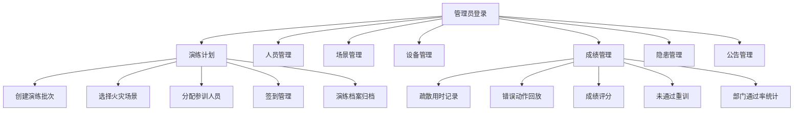

## 1. 产品概述

VR 消防演练运营平台是面向园区安全管理员的沉浸式消防培训管理系统，通过 VR 技术为员工提供逼真的火灾逃生演练体验，帮助企业提升消防安全培训效率和效果。

- **核心价值**：将传统消防培训升级为沉浸式 VR 演练，降低培训成本，提升培训效果
- **目标用户**：园区安全管理员、企业 HR、消防安全负责人
- **主要问题**：传统消防培训形式单一、实操成本高、难以量化培训效果

## 2. 核心功能

### 2.1 用户角色

| 角色 | 登录方式 | 核心权限 |
|------|----------|----------|
| 安全管理员 | 账号密码登录 | 全部功能管理权限，包括演练计划、人员、场景、设备、成绩、隐患、公告的全面管理 |

### 2.2 功能模块

1. **演练计划**：演练批次创建、场景选择、人员分配、签到管理、演练档案归档
2. **人员管理**：员工信息管理、部门组织架构、参训记录
3. **场景管理**：火灾场景配置、逃生路线设置、灭火器步骤、烟雾识别题
4. **设备管理**：VR 头显设备预约、设备状态监控、使用记录
5. **成绩管理**：疏散用时记录、错误动作回放、成绩评分、未通过重训、部门通过率统计
6. **隐患管理**：隐患照片上传、整改责任人指定、整改进度跟踪
7. **公告管理**：培训公告发布、公告列表、通知推送

### 2.3 页面详情

| 页面名称 | 模块名称 | 功能描述 |
|----------|----------|----------|
| 演练计划 | 批次列表 | 展示所有演练批次，支持搜索、筛选、分页 |
| 演练计划 | 创建批次 | 选择火灾场景、分配参训人员、设置演练时间 |
| 演练计划 | 签到管理 | 查看签到状态、手动补签、导出签到表 |
| 人员管理 | 人员列表 | 展示员工信息、部门归属、参训状态 |
| 人员管理 | 部门统计 | 各部门人数、参训率、通过率统计 |
| 场景管理 | 场景列表 | 展示可用火灾场景、场景难度等级 |
| 场景管理 | 逃生路线 | 配置逃生路线、安全出口、集结点 |
| 场景管理 | 灭火器设置 | 灭火器使用步骤、正误判定 |
| 场景管理 | 烟雾识别题 | 烟雾类型识别题目配置 |
| 设备管理 | 设备列表 | VR 头显设备状态、编号、位置 |
| 设备管理 | 设备预约 | 预约头显设备、查看预约记录 |
| 成绩管理 | 成绩列表 | 参训人员成绩、用时、评分 |
| 成绩管理 | 错误回放 | 错误动作记录、回放查看 |
| 成绩管理 | 重训管理 | 未通过人员重训安排 |
| 成绩管理 | 统计分析 | 部门通过率、平均用时、错误类型统计 |
| 隐患管理 | 隐患列表 | 隐患照片、等级、状态 |
| 隐患管理 | 整改管理 | 指定整改责任人、设置整改期限 |
| 公告管理 | 公告列表 | 培训公告展示、置顶、过期管理 |
| 公告管理 | 发布公告 | 创建、编辑、发布培训公告 |

## 3. 核心流程

### 3.1 演练创建流程

管理员创建演练批次 → 选择火灾场景 → 分配参训人员 → 预约 VR 设备 → 发布演练通知 → 员工签到参训 → 成绩记录归档

### 3.2 成绩管理流程

员工完成 VR 演练 → 系统记录疏散用时和错误动作 → 自动评分 → 生成成绩报告 → 未通过人员标记重训 → 部门通过率统计

### 3.3 隐患管理流程

发现安全隐患 → 上传隐患照片 → 指定等级和类型 → 分配整改责任人 → 设置整改期限 → 整改完成审核 → 隐患闭环

## 4. 用户界面设计

### 4.1 设计风格

- **主色调**：消防红 (#E53935) 作为主色，配合深灰 (#1A1A2E) 背景，营造专业严肃的安全管理氛围
- **辅助色**：橙色 (#FF9800) 用于警示，绿色 (#4CAF50) 用于安全状态，蓝色 (#2196F3) 用于信息提示
- **按钮风格**：圆角 8px，带微妙阴影，悬停时有缩放和阴影加深效果
- **字体**：使用 Noto Sans SC 作为中文显示字体，配合 JetBrains Mono 作为数据展示字体
- **布局风格**：左侧导航栏 + 顶部状态栏 + 主内容区的经典后台管理布局，卡片式内容展示
- **图标风格**：使用 lucide-react 线性图标，统一 24px 尺寸

### 4.2 视觉风格定位

**工业科技风**：以深色主题为基础，融入消防元素和科技感设计。采用玻璃态卡片效果、渐变背景、微光动效，体现 VR 技术与消防安全的结合。界面层次分明，数据可视化突出，让管理员能够快速掌握演练状态。

### 4.3 页面设计概览

| 页面名称 | 模块名称 | UI 元素 |
|----------|----------|---------|
| 演练计划 | 批次列表 | 数据表格、状态标签、搜索筛选栏、操作按钮组 |
| 演练计划 | 创建批次 | 分步表单、场景选择卡片、人员选择器 |
| 人员管理 | 人员列表 | 头像列表、部门树形结构、统计卡片 |
| 场景管理 | 场景列表 | 场景卡片网格、难度等级标识、预览图 |
| 设备管理 | 设备列表 | 设备状态卡片、在线/离线指示灯、预约日历 |
| 成绩管理 | 成绩列表 | 排行榜样式、进度条、分数圆环图 |
| 成绩管理 | 统计分析 | 柱状图、折线图、饼图数据可视化 |
| 隐患管理 | 隐患列表 | 照片墙布局、风险等级色标、整改进度条 |
| 公告管理 | 公告列表 | 时间线布局、置顶标识、类型图标 |

### 4.4 响应式设计

- **设计原则**：桌面端优先，适配 1280px 及以上分辨率
- **侧边栏**：可折叠收起，在小屏幕上转为汉堡菜单
- **数据表格**：支持横向滚动，关键列固定
- **卡片布局**：自适应网格，根据屏幕宽度调整列数

### 4.5 动效设计

- **页面切换**：淡入淡出 + 轻微上移动画，时长 300ms
- **卡片悬停**：上移 4px + 阴影加深，时长 200ms
- **数据加载**：骨架屏闪烁效果
- **状态变化**：颜色渐变过渡，时长 300ms
- **导航展开/收起**：平滑宽度过渡，时长 250ms
