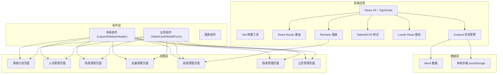
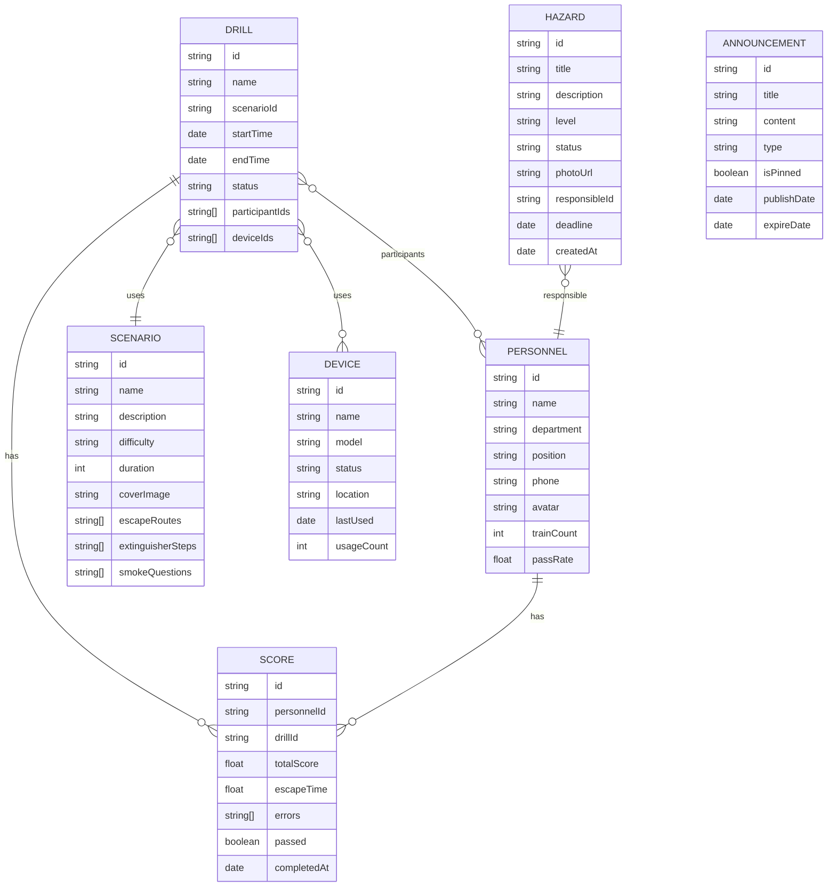

## 1. 架构设计



## 2. 技术选型说明

- **前端框架**：React 18 + TypeScript，提供组件化开发和类型安全
- **构建工具**：Vite，快速的开发体验和快速热更新
- **路由管理**：React Router v6，单页面路由管理
- **状态管理**：Zustand，轻量级状态管理库
- **样式方案**：TailwindCSS 3，原子化 CSS，快速构建 UI
- **图标库**：Lucide React，轻量级图标库
- **图表库**：Recharts，基于 React 的图表组件库
- **后端**：无后端，使用 Mock 数据 + localStorage 持久化

## 3. 路由定义

| 路由路径 | 页面名称 | 说明 |
|----------|----------|------|
| / | 演练计划 | 默认首页，展示演练批次列表 |
| /drills | 演练计划 | 演练批次管理 |
| /personnel | 人员管理 | 员工信息和部门管理 |
| /scenarios | 场景管理 | 火灾场景和配置 |
| /devices | 设备管理 | VR 头显设备管理 |
| /scores | 成绩管理 | 演练成绩和统计 |
| /hazards | 隐患管理 | 安全隐患管理 |
| /announcements | 公告管理 | 培训公告管理 |

## 4. 数据模型

### 4.1 数据实体关系



### 4.2 类型定义

```typescript
// 演练批次
interface Drill {
  id: string;
  name: string;
  scenarioId: string;
  scenarioName?: string;
  startTime: string;
  endTime: string;
  status: 'pending' | 'ongoing' | 'completed' | 'cancelled';
  participantIds: string[];
  participantCount?: number;
  checkedInCount?: number;
  deviceIds: string[];
  createdAt: string;
}

// 人员
interface Personnel {
  id: string;
  name: string;
  department: string;
  position: string;
  phone: string;
  avatar: string;
  trainCount: number;
  passRate: number;
  lastTrainDate?: string;
}

// 场景
interface Scenario {
  id: string;
  name: string;
  description: string;
  difficulty: 'easy' | 'medium' | 'hard';
  duration: number;
  coverImage: string;
  escapeRoutes: EscapeRoute[];
  extinguisherSteps: ExtinguisherStep[];
  smokeQuestions: SmokeQuestion[];
}

interface EscapeRoute {
  id: string;
  name: string;
  startPoint: string;
  endPoint: string;
  description: string;
}

interface ExtinguisherStep {
  id: string;
  step: number;
  description: string;
  isCorrect: boolean;
}

interface SmokeQuestion {
  id: string;
  question: string;
  image: string;
  options: string[];
  correctAnswer: number;
}

// 设备
interface Device {
  id: string;
  name: string;
  model: string;
  status: 'available' | 'in-use' | 'maintenance' | 'offline';
  location: string;
  lastUsed?: string;
  usageCount: number;
  currentUser?: string;
}

// 成绩
interface Score {
  id: string;
  personnelId: string;
  personnelName?: string;
  drillId: string;
  drillName?: string;
  totalScore: number;
  escapeTime: number;
  errors: ErrorRecord[];
  passed: boolean;
  completedAt: string;
  retrainCount: number;
}

interface ErrorRecord {
  id: string;
  type: string;
  description: string;
  timestamp: number;
  videoClip?: string;
}

// 隐患
interface Hazard {
  id: string;
  title: string;
  description: string;
  level: 'low' | 'medium' | 'high' | 'critical';
  status: 'pending' | 'processing' | 'resolved' | 'verified';
  photoUrl: string;
  responsibleId?: string;
  responsibleName?: string;
  deadline?: string;
  createdAt: string;
  resolvedAt?: string;
}

// 公告
interface Announcement {
  id: string;
  title: string;
  content: string;
  type: 'training' | 'notice' | 'warning' | 'info';
  isPinned: boolean;
  publishDate: string;
  expireDate?: string;
  author: string;
}
```

## 5. 项目结构

```
src/
├── components/          # 通用组件
│   ├── layout/         # 布局组件
│   │   ├── Layout.tsx
│   │   ├── Sidebar.tsx
│   │   └── Header.tsx
│   ├── ui/           # UI 基础组件
│   │   ├── Button.tsx
│   │   ├── Card.tsx
│   │   ├── Modal.tsx
│   │   ├── Table.tsx
│   │   ├── Badge.tsx
│   │   └── Input.tsx
│   └── charts/       # 图表组件
│       └── ScoreChart.tsx
├── pages/             # 页面组件
│   ├── drills/       # 演练计划
│   │   ├── DrillList.tsx
│   │   ├── DrillCreate.tsx
│   │   └── CheckInModal.tsx
│   ├── personnel/    # 人员管理
│   │   ├── PersonnelList.tsx
│   │   └── DepartmentStats.tsx
│   ├── scenarios/     # 场景管理
│   │   ├── ScenarioList.tsx
│   │   ├── EscapeRouteConfig.tsx
│   │   ├── ExtinguisherConfig.tsx
│   │   └── SmokeQuestionConfig.tsx
│   ├── devices/       # 设备管理
│   │   ├── DeviceList.tsx
│   │   └── DeviceBooking.tsx
│   ├── scores/        # 成绩管理
│   │   ├── ScoreList.tsx
│   │   ├── ErrorReplay.tsx
│   │   ├── RetrainModal.tsx
│   │   └── Statistics.tsx
│   ├── hazards/       # 隐患管理
│   │   ├── HazardList.tsx
│   │   └── HazardCreate.tsx
│   └── announcements/ # 公告管理
│       ├── AnnouncementList.tsx
│       └── AnnouncementCreate.tsx
├── store/             # 状态管理
│   └── useStore.ts
├── data/              # Mock 数据
│   ├── drills.ts
│   ├── personnel.ts
│   ├── scenarios.ts
│   ├── devices.ts
│   ├── scores.ts
│   ├── hazards.ts
│   └── announcements.ts
├── types/             # 类型定义
│   └── index.ts
├── utils/             # 工具函数
│   └── index.ts
├── App.tsx
├── main.tsx
└── index.css
```

## 6. 状态管理设计

使用 Zustand 进行全局状态管理，按模块划分 store：

```typescript
// store/useStore.ts

interface AppState {
  // 演练
  drills: Drill[];
  currentDrill: Drill | null;
  
  // 人员
  personnel: Personnel[];
  
  // 场景
  scenarios: Scenario[];
  
  // 设备
  devices: Device[];
  
  // 成绩
  scores: Score[];
  
  // 隐患
  hazards: Hazard[];
  
  // 公告
  announcements: Announcement[];
  
  // UI 状态
  sidebarCollapsed: boolean;
  
  // Actions
  setSidebarCollapsed: (collapsed: boolean) => void;
  addDrill: (drill: Drill) => void;
  updateDrill: (id: string, drill: Partial<Drill>) => void;
  deleteDrill: (id: string) => void;
  // ... 其他 actions
}
```

## 7. 核心功能实现方案

### 7.1 演练计划
- 批次列表：数据表格展示，支持搜索、筛选、分页
- 创建批次：分步表单，包含场景选择、人员选择、时间设置
- 签到管理：弹窗形式，展示签到状态，支持手动补签

### 7.2 人员管理
- 人员列表：卡片式展示，支持部门筛选
- 部门统计：顶部统计卡片，展示各部门数据

### 7.3 场景管理
- 场景列表：网格卡片布局，展示场景预览和难度
- Tab 切换：逃生路线、灭火器步骤、烟雾识别题三个配置 Tab

### 7.4 设备管理
- 设备列表：状态卡片，展示设备在线状态
- 设备预约：日历视图，展示预约记录

### 7.5 成绩管理
- 成绩列表：排行榜样式，分数进度条
- 统计分析：Recharts 图表，部门通过率、错误类型分布
- 错误回放：时间线展示错误动作

### 7.6 隐患管理
- 隐患列表：照片墙布局，风险等级色标
- 整改管理：弹窗表单，指定责任人和期限

### 7.7 公告管理
- 公告列表：时间线布局，置顶标识
- 发布公告：富文本编辑器（简化版 textarea）
